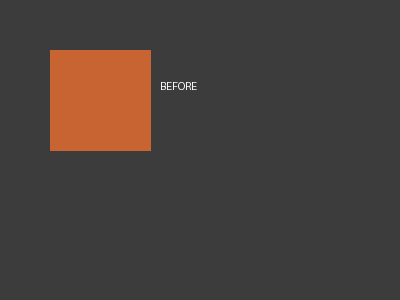
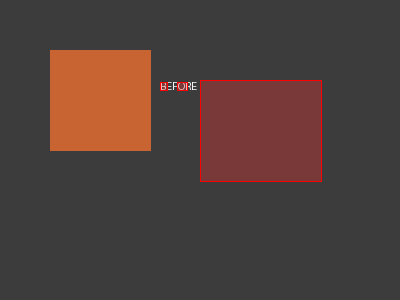

# vizdiff

```text
##      ## ########## ########## ########   ########## ########## ##########
##      ##     ##           ##   ##      ##     ##     ##         ##        
##      ##     ##         ##     ##      ##     ##     ########   ########  
  ##  ##       ##       ##       ##      ##     ##     ##         ##        
    ##     ########## ########## ########   ########## ##         ##        
```

**Spot the difference — visual regression for screenshots, in your terminal.**

Compare two images or two directories of screenshots. Get a similarity score, highlighted diff regions, a side-by-side view, and an HTML report. Built for developers who screenshot their UI and want to catch visual regressions before they ship.

[](https://www.python.org/)
[](LICENSE)
[](https://python-pillow.org/)




*Top: before (left) and after (right) screenshots. Bottom: pixel-level diff overlay — red regions show exactly what changed. Similarity: 91.90%.*

## Quickstart

```bash
pip install -e .
```

```bash
# Compare two images
vizdiff before.png after.png

# Compare screenshot directories
vizdiff screenshots/before/ screenshots/after/

# Save an HTML report with highlighted diffs
vizdiff before.png after.png --html report.html
```

## What it does

vizdiff compares two images pixel-by-pixel and tells you exactly what changed. It's the tool you reach for when you screenshot a UI before and after a change and need to know: did anything break?

### Terminal report

```
============================================================
  VIZDIFF -- Visual Regression Report
============================================================
  Image A: before.png
  Image B: after.png
  Size:    1920x1080
  Status:  MODERATE
  Similarity: 94.23%
  Diff pixels: 118,432 / 2,073,600

  Diff regions: 3
    [1] HIGH       area=87,456px  box=(340, 210, 780, 540)
    [2] MEDIUM     area=24,180px  box=(1200, 80, 1340, 120)
    [3] LOW        area=5,210px   box=(100, 950, 250, 1020)

  Verdict: FAIL
============================================================
```

### HTML report

Generates a self-contained HTML file with:
- Similarity percentage and diff pixel count at a glance
- PASS/FAIL verdict (pass if similarity >= 98%)
- Side-by-side image with red highlighted diff regions
- Table of diff regions with severity, area, and bounding box
- Opens in any browser, no external assets, no server needed

### Directory comparison

Compare entire directories of screenshots — files are matched by name:

```bash
vizdiff tests/screenshots/baseline/ tests/screenshots/current/ --html report.html
```

Each pair is compared individually, and an overall similarity average is reported.

## Features

- **Pixel-level diff** — compares every pixel, counts changed pixels above a threshold
- **Contiguous region detection** — groups adjacent changed pixels into diff regions with bounding boxes
- **Severity classification** — HIGH (>5% of image area), MEDIUM (>1%), LOW (everything else)
- **Similarity score** — 1.0 = identical, 0.0 = completely different
- **Side-by-side output** — before on left, after with red diff overlay on right
- **HTML report** — self-contained, no external assets, opens in any browser
- **Directory mode** — compare folders of screenshots, matched by filename
- **Configurable threshold** — `--threshold 30` (default), adjust what counts as "changed"
- **Configurable min region** — `--min-region 50` (default), filter out tiny noise
- **Pass/fail mode** — `--passed` exits 0 if similar (>=98%), 1 if different (CI-friendly)

## Installation

```bash
git clone https://github.com/yourusername/vizdiff.git
cd vizdiff
pip install -e .
```

Requires Python 3.9+ and Pillow:

```bash
pip install Pillow
```

## Usage

### Basic comparison

```bash
vizdiff screenshot_before.png screenshot_after.png
```

### With HTML report

```bash
vizdiff screenshot_before.png screenshot_after.png --html diff_report.html
```

### Adjust sensitivity

```bash
# Higher threshold = fewer pixels count as changed (more strict)
vizdiff before.png after.png --threshold 50 --min-region 100
```

### Pass/fail for CI

```bash
vizdiff before.png after.png --passed
# Exit 0 if similar (>=98%), exit 1 if different
```

### Directory comparison

```bash
vizdiff tests/screenshots/baseline/ tests/screenshots/current/ --html full_report.html
```

### Programmatic use

```python
from vizdiff import compute_diff, terminal_report

result = compute_diff("before.png", "after.png", threshold=30, min_region_area=50)
print(terminal_report(result))
print(f"Similarity: {result.similarity:.2%}")
print(f"Regions found: {len(result.regions)}")

# Access the generated images
result.diff_image.save("diff_overlay.png")       # red highlights on before
result.side_by_side.save("side_by_side.png")     # before | after with overlay
```

## Project structure

```
vizdiff/
├── __init__.py   # Public API: compute_diff, DiffResult, terminal_report, html_report
├── differ.py     # Core diff engine — pixel comparison, region detection, image generation
├── report.py     # Terminal and HTML report generators
└── cli.py        # CLI interface (argparse)
```

## Requirements

- Python 3.9+
- Pillow 10.0+

```bash
pip install Pillow
```

## License

MIT License — see [LICENSE](LICENSE).
